<div align="center">


# 🦅 SAHASRA

### _“A thousand eyes. One pattern nobody else could see.”_

**An AI-first Crime Intelligence Operating System for the Karnataka State Police**
Real-time hotspots · criminal-network graphs · predictive patrols · tamper-evident governance — on the web **and** in an officer’s pocket.

<br>

Presented by **Team Cipher Syndicate** · **KSP Datathon 2026**
**Disha Pandey** — Team Lead &nbsp;·&nbsp; **Kartik Chilkoti** — Member

<br>


</div>

---

## ▶️ Demo Video

<div align="center">

<a href="https://drive.google.com/file/d/1EJMpkJoOaEpGDyEtIfV1Zx871UoJI8zo/view?usp=drivesdk">
  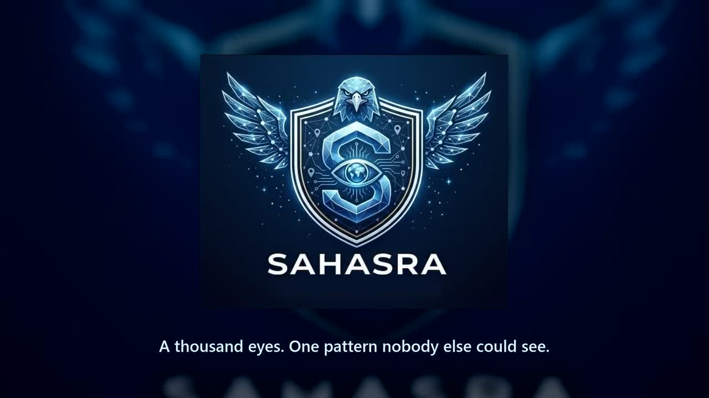
</a>

**▶ [Watch the full 2½-minute demo](https://drive.google.com/file/d/1EJMpkJoOaEpGDyEtIfV1Zx871UoJI8zo/view?usp=drivesdk)** &nbsp;·&nbsp; 1080p · real screenshots + real app footage

</div>

> _Tip: click the poster to play the demo on Google Drive._

---

## 📑 Table of Contents

- [The Problem](#-the-problem)
- [The Solution](#-the-solution)
- [Feature Highlights](#-feature-highlights)
- [See It Running](#-see-it-running-screenshots)
- [System Architecture](#-system-architecture)
- [The Intelligence Engine](#-the-intelligence-engine)
- [Dataset & References](#-dataset--references)
- [Tech Stack](#-tech-stack)
- [Demo Access](#-demo-access)
- [Getting Started](#-getting-started)
- [Project Structure](#-project-structure)
- [Team](#-team)

---

## 🎯 The Problem

Karnataka is policed by **1,100+ stations** generating enormous streams of FIRs, incidents, ANPR hits, and field reports — but they operate as **islands of data**. A syndicate operating across three districts looks like three unrelated cases. A rising hotspot is only obvious _after_ the crimes happen. And when an AI flags a suspect, nobody can explain _why_.

> **There was no single pane of glass to see if it’s all connected — and no way to trust the AI that connects it.**

## 💡 The Solution

**SAHASRA** (*सहस्र* — “a thousand”) is a unified crime-intelligence platform that turns a real **201,733-record KSP corpus** into decisions a jury understands in three seconds:

- 🗺️ **Sees patterns** — spatio-temporal hotspots + criminal-network graphs
- 🔮 **Sees ahead** — genuine time-series forecasting of tomorrow’s risk
- 🧾 **Stays honest** — every score explained in plain language; every action sealed in a tamper-evident ledger
- 📱 **Reaches the ground** — the same intelligence in a field-officer app with one-tap SOS → live dispatch

---

## ✨ Feature Highlights

| | Capability | What it does |
|---|---|---|
| 🧭 | **Command Center** | Live anomaly stream + AI-flag supervisor review queue with confidence scores |
| 🗺️ | **Hotspot Map** | ST-DBSCAN spatio-temporal clustering of high-density crime zones |
| 🕸️ | **Network Graph** | Louvain community detection — confirmed links solid, AI-inferred links dashed |
| 📈 | **Crime Trends & Forecast** | Holt’s double-exponential smoothing over real weekly incident counts |
| 🎯 | **Predictive Patrol Planner** | Fuses intensity × forecast × time-slot risk × live fleet into deployable routes |
| 📷 | **Camera Intelligence** | On-device TensorFlow.js (COCO-SSD) object tracking + ANPR match alerts |
| 🔎 | **Case Explorer (QuickML)** | Natural-language search with parsed-intent structured filters (EN + ಕನ್ನಡ) |
| 🧬 | **Behavioral Profiler** | Agglomerative MO clustering into named crime signatures |
| 🛡️ | **Governance & Audit** | Tamper-evident **SHA-256 hash-chain** ledger + RBAC + fairness metrics |
| 📡 | **Akka Patrol Fleet** | Live unit telemetry + real haversine nearest-unit dispatch |
| 🆘 | **Field-Officer App** | Login → beat feed → evidence chain-of-custody → Panic/SOS → dispatch |

---

## 🖼️ See It Running (Screenshots)

### 🌐 Web Command Console

| State Police Command Center | Gang Link Graph — Louvain Community Detection |
|:---:|:---:|
| 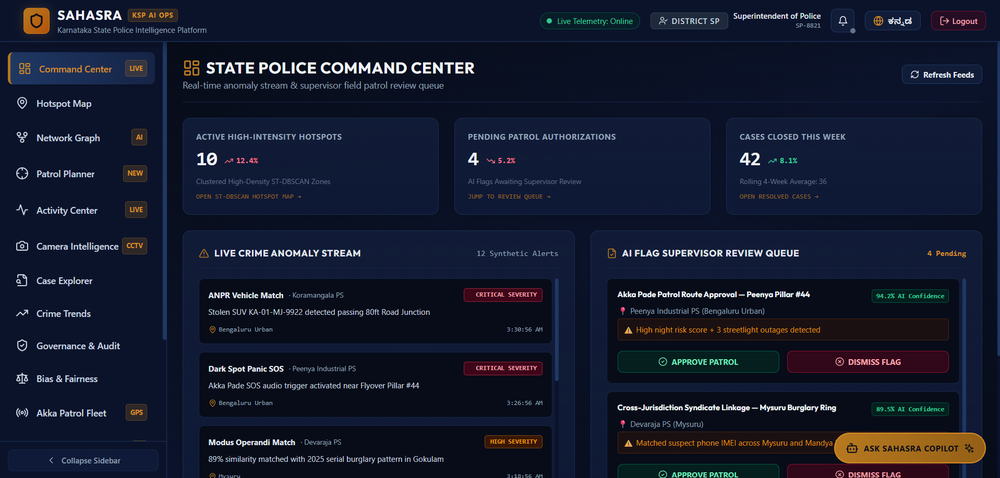 | 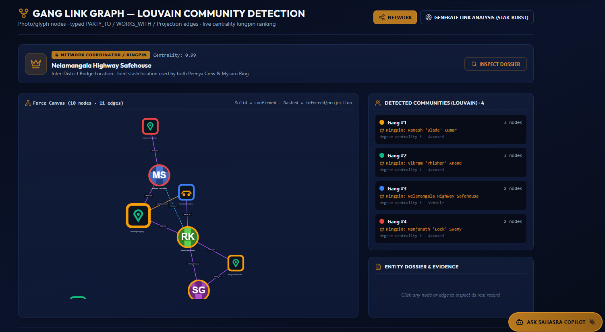 |
| _KPIs, live crime-anomaly stream & AI-flag review queue._ | _Force-canvas network — solid = confirmed, dashed = inferred._ |

| Incident Star-burst (Network Graph) | Crime Trends & Forecast Engine |
|:---:|:---:|
| 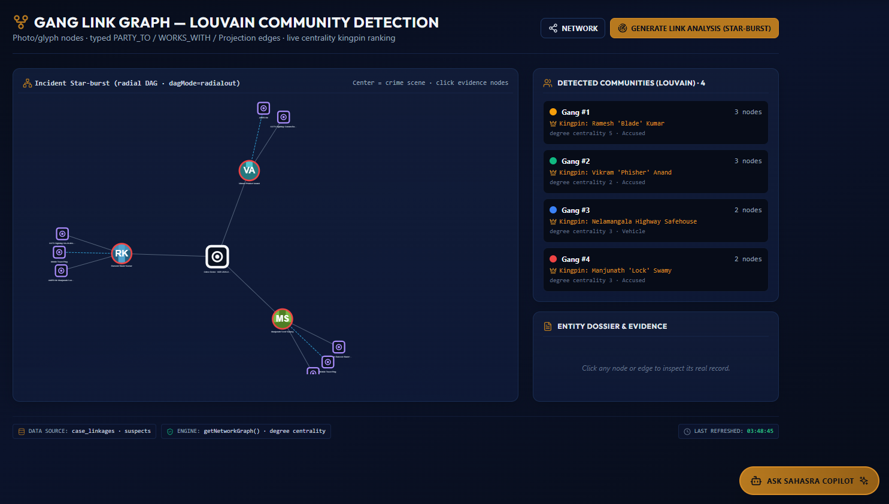 | 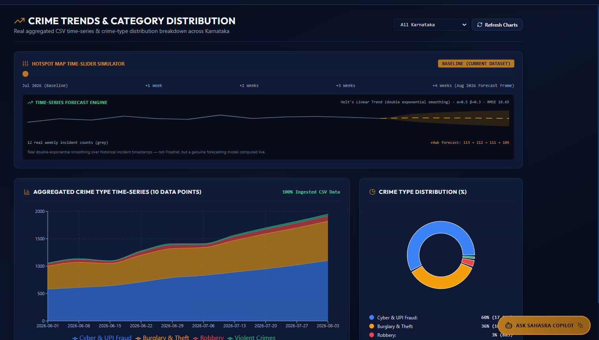 |
| _Radial DAG centred on a crime scene with evidence nodes._ | _Time-slider simulator + Holt’s linear-trend forecast._ |

| Governance, Audit Ledger & Bias Panel | Predictive Patrol Planner |
|:---:|:---:|
| 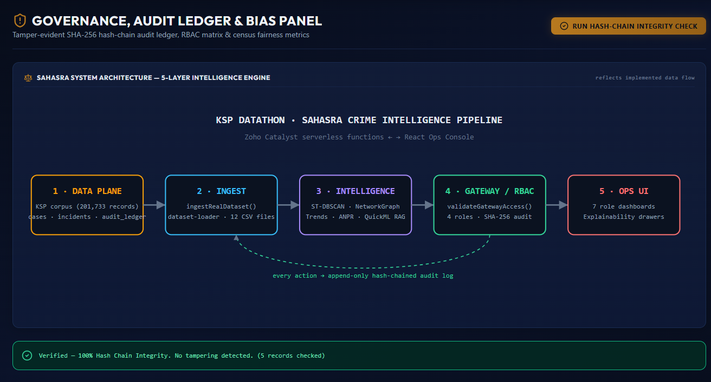 | 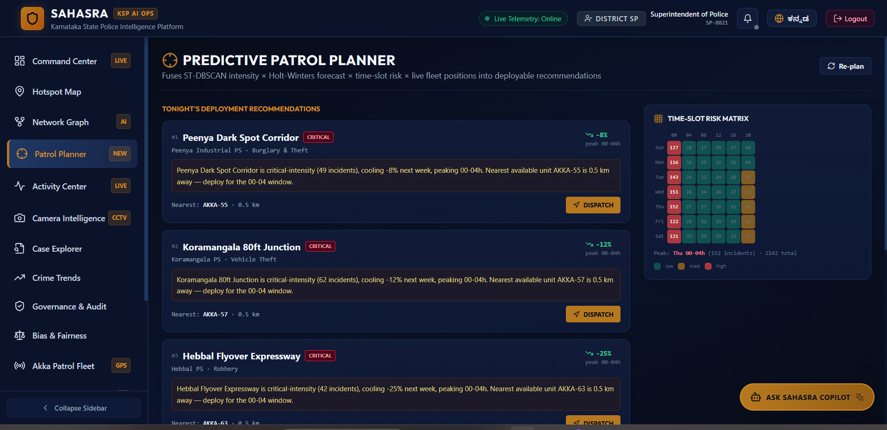 |
| _5-layer engine + “100% Hash-Chain Integrity — no tampering.”_ | _Tonight’s deployments + time-slot risk matrix._ |

| Case Explorer & QuickML AI Search | Akka Patrol Fleet — Live Dispatch |
|:---:|:---:|
| 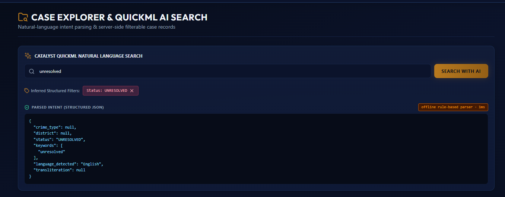 | 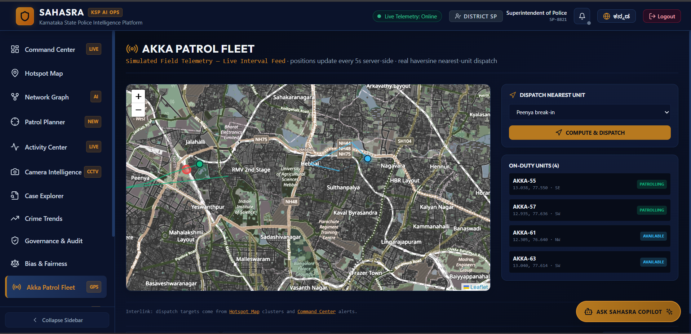 |
| _NL intent parsing → structured, filterable case records._ | _On-duty units + “Dispatch Nearest Unit → Compute & Dispatch.”_ |

| Behavioral Pattern Profiler | Nearby Unit Locator |
|:---:|:---:|
| 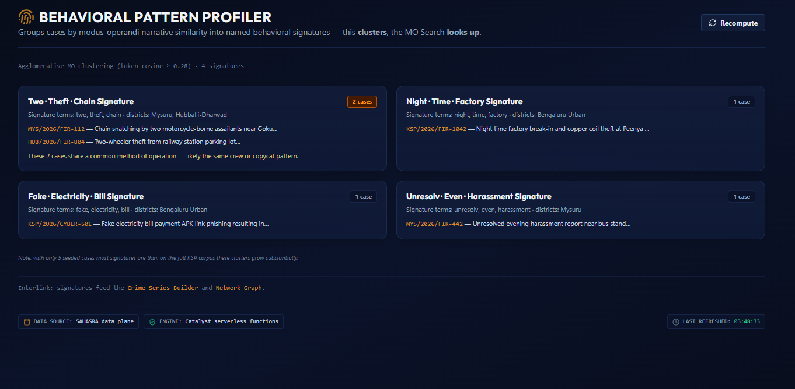 | 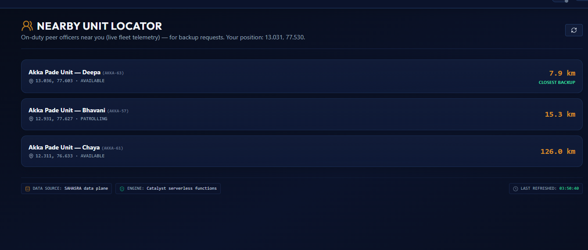 |
| _Agglomerative MO clustering into named signatures._ | _On-duty peer officers by distance for backup._ |

### 📱 Field-Officer Mobile App

| SAHASRA Ops Login | Evidence & Chain-of-Custody | Akka Patrol Fleet Dispatch |
|:---:|:---:|:---:|
| 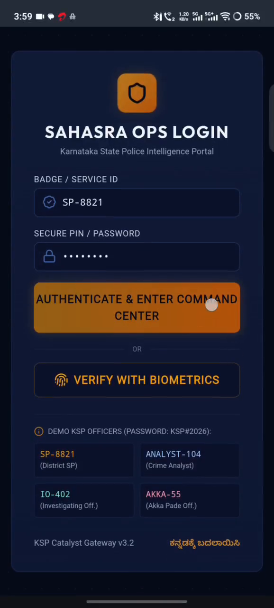 | 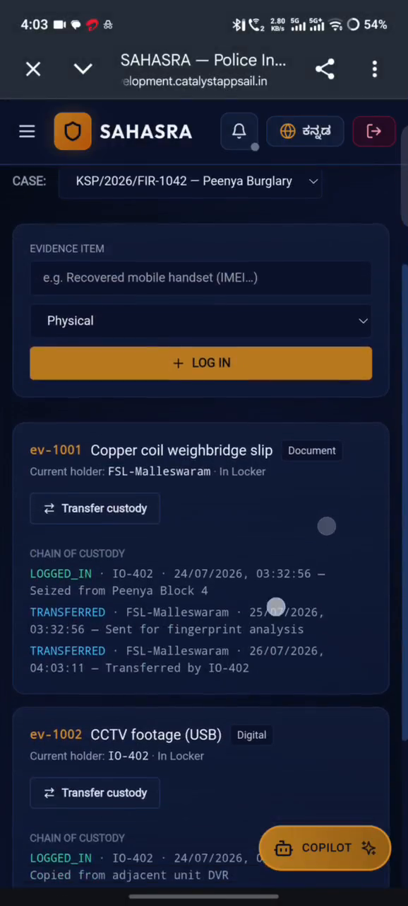 | 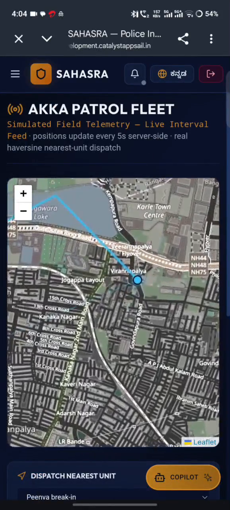 |
| _Badge + secure-PIN / biometric login._ | _Tamper-proof evidence ledger, in the field._ | _Live telemetry + Panic/SOS → real-time dispatch._ |

---

## 🏗️ System Architecture

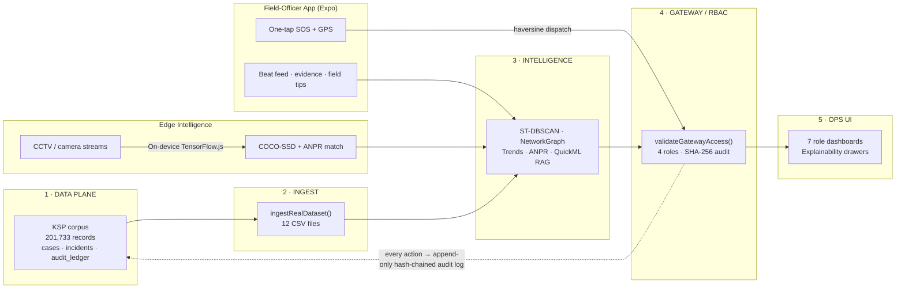

---

## 🧠 The Intelligence Engine

Every layer runs **for real** — not mocked:

| Technique | Where | What it delivers |
|---|---|---|
| **ST-DBSCAN** (ε ≈ 600 m) | Hotspot Map / Patrol Planner | Density-based spatio-temporal hotspot clusters |
| **Louvain modularity** | Network Graph | Detects gang/syndicate communities & kingpin centrality |
| **Holt double-exponential smoothing** | Crime Trends | Genuine forecast of next-4-week incident counts (RMSE reported) |
| **TF-IDF + cosine** | Case Explorer / MO Profiler | Semantic “find similar modus-operandi” across districts |
| **TensorFlow.js COCO-SSD** | Camera Intelligence | Client-side object detection + ANPR vehicle-match alerts |
| **SHA-256 hash chain** | Governance & Audit | Append-only, tamper-evident operational ledger |
| **RBAC gateway** | All roles | 4 role types, per-action authorization + audit |

---

## 🗃️ Dataset & References

SAHASRA is grounded in **real Karnataka crime data** — a **201,733-record corpus** ingested from 12 CSV files in [`/dataset`](dataset):

| File | Contents |
|---|---|
| `ka-ipc-crimes-2025.csv` | Karnataka IPC (Indian Penal Code) crimes, 2025 |
| `ka-sll-crimes-2025.csv` | Karnataka SLL (Special & Local Laws) crimes, 2025 |
| `ka-district-wise-2025.csv` | District-wise crime distribution across Karnataka |
| `crime_review_for_the_month_of_december_2025_9.csv` | Monthly crime review (Dec 2025) |
| `*.csv` (portal exports) | Additional KSP open-data extracts (incidents, categories, stations) |

**Public data sources:**
- 🏛️ **Karnataka State Police** — [ksp.karnataka.gov.in](https://ksp.karnataka.gov.in/)
- 🇮🇳 **Government of India Open Data Platform** — [data.gov.in](https://data.gov.in/)
- 📊 **National Crime Records Bureau (NCRB)** — [ncrb.gov.in](https://ncrb.gov.in/)

> All personal identifiers in the demo corpus are synthetic/anonymized; the pipeline is built to plug into live KSP feeds.

---

## 🛠️ Tech Stack

| Layer | Technologies | Key Packages / Algorithms |
|---|---|---|
| **Mobile** | Expo SDK 54 · React Native 0.81 | Expo Router v6, Expo Location, Expo Sensors |
| **Web Console** | React 18 · Vite · TailwindCSS | Recharts, Leaflet, react-force-graph-2d |
| **Intelligence** | TensorFlow.js · Groq | COCO-SSD, ST-DBSCAN, Louvain, Holt-Winters, TF-IDF |
| **Backend** | Node.js 20 · Express · TypeScript | WebSocket `ws` bus, JWT auth, bcryptjs |
| **Serverless / Deploy** | Zoho Catalyst · esbuild | Self-contained ESM bundle, SHA-256 hash-chain ledger |
| **Data** | Drizzle ORM · ZCQL | 201,733-record KSP corpus (12 CSVs) |

---

## 🔑 Demo Access

The **SAHASRA Ops** login — password for all demo officers: **`Ksp#2026`** (the web Login screen pre-fills it and has one-click role quick-fill)

| Role | Badge / Service ID |
|---|---|
| District SP | `SP-8821` |
| Crime Analyst | `ANALYST-104` |
| Investigating Officer | `IO-402` |
| Akka Pade Officer | `AKKA-55` |

---

## 🚀 Getting Started

### Prerequisites
- [Node.js **v20+**](https://nodejs.org/)
- Expo Go (for the mobile app) · a modern browser (for the console)

### 1 · Install
```bash
# root (server + mobile)
npm install

# web console
cd web && npm install && cd ..
```

### 2 · Environment
Create `.env` in the project root:
```env
PORT=5000
GROQ_API_KEY=your_groq_key_here
JWT_SECRET=your_jwt_secret_here
```

### 3 · Run
```bash
npm run dev     # backend + web assets  (server/index.ts via tsx)
npm run app     # Expo mobile app       (npx expo start)
```

### 4 · Build & Deploy (Zoho Catalyst)
```bash
npm run catalyst:build   # builds web/ + bundles server to build/index.mjs
npm run catalyst:start    # runs the production bundle
```

---

## 📁 Project Structure

```
sahasra/
├── app/            # Expo Router screens (field-officer mobile app)
├── components/     # shared React Native components (IntelHub, etc.)
├── web/            # React + Vite crime-intelligence web console
├── server/         # Express + WebSocket backend (TypeScript)
├── functions/      # Zoho Catalyst serverless functions
├── dataset/        # 12 CSVs — the 201,733-record KSP corpus
├── shared/         # shared types & schema (Drizzle)
├── docs/           # README assets: demo video, screenshots, logo
└── videos/         # HyperFrames pitch-video project + renders
```

---

## 👥 Team — Cipher Syndicate

| Name | Role |
|---|---|
| **Disha Pandey** | Team Lead |
| **Kartik Chilkoti** | Member |

<div align="center">

**SAHASRA** · _A thousand eyes. One pattern nobody else could see._
Built with pride for the **KSP Datathon 2026** 🦅

</div>
